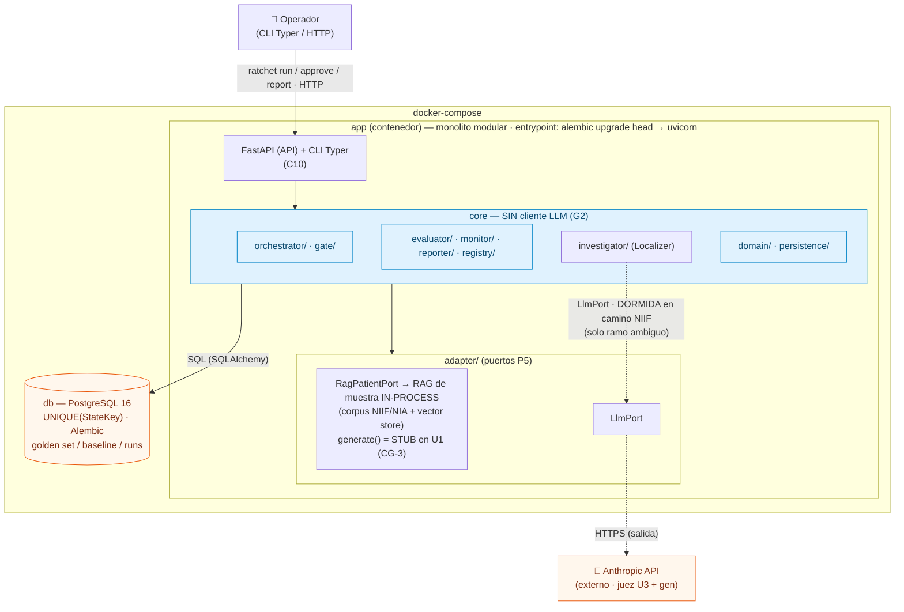
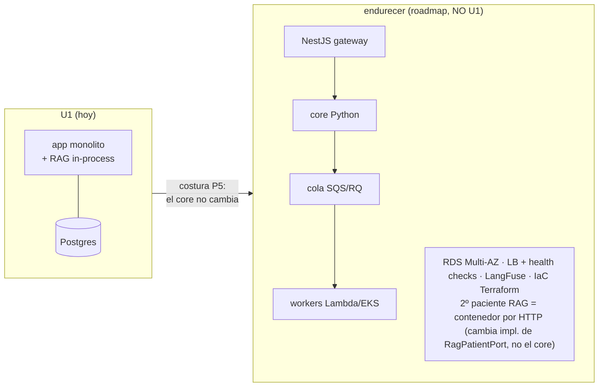

# Deployment Architecture (mínimo) — U1 · Camino NIIF

> Diagrama de despliegue del walking skeleton. Un solo desplegable + Postgres; RAG de muestra in-process.

## Topología (docker-compose) — diagrama de despliegue

> **Leyenda:** líneas sólidas = ruta viva del camino NIIF (hermética, sin red). Líneas punteadas (`-.->`) = ruta **dormida** en el camino NIIF (solo se activa en el ramo ambiguo del localizador). `gate/`/`orchestrator/` no tienen arista al LLM (G2, enforced por import-linter).

## Flujos

- **Operador → app:** CLI (`ratchet run|report|approve`) o HTTP (`POST /runs`, `GET /runs/{id}/report`, `POST /approvals/{id}`). Misma superficie (C10).
- **app → db:** SQLAlchemy; corridas idempotentes por `UNIQUE(StateKey)`.
- **app → RAG (in-process):** llamadas de método vía `RagPatientPort` (retrieve/generate/config/data-ops + `corpus_fingerprint`). Sin red.
- **app → Anthropic (red, salida):** solo desde `investigator/` (Localizer delgado); `gate/`/`orchestrator/` **no** (G2, enforced por import-linter). `RetryPolicy` envuelve solo lecturas. **Dormida en el camino NIIF** (localización determinista por `span_vigente_en_corpus`); se activa solo en el ramo ambiguo.
- **RAG `generate()`:** **stub en U1** (determinista, sin red — CG-3). Un `generate()` real usaría el **cliente LLM propio del RAG** (no el `LlmPort` de Ratchet — P5), en U3.
- **Propiedad:** el **e2e NIIF es libre-de-LLM y hermético** (sin key, sin red, reproducible en CI). Ver `infrastructure-design.md §Determinismo`.

## Ciclo de vida
1. `docker-compose up` → `db` levanta; `app` entrypoint corre `alembic upgrade head` y luego sirve.
2. Golden set se carga (CLI/seed) → baseline se fija (rechaza si <50).
3. Corrida del loop (síncrona, <5 min) → reporte antes/después persistido.
4. Reinicio: `app` es stateless → recupera todo de `db`.

## Escalado (documentado, NO U1)

- La costura P5 (adaptador por interfaz) es lo que hace barato este salto: el core no cambia.
