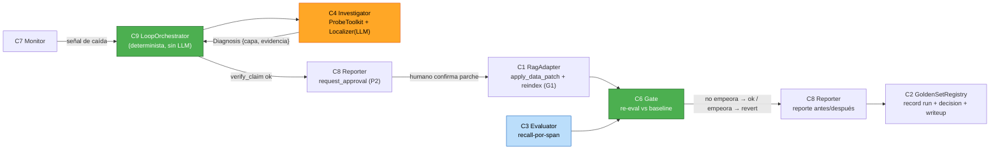

# Dependencias y Flujo de Datos — Ratchet

## Matriz de dependencias (fila depende de → columna)
| ↓ depende de → | C1 Adapter | C2 Registry | C3 Evaluator | C4 Investig. | C5 Experim. | C6 Gate | C7 Monitor | C8 Reporter | C9 Orchestr. | C11 JobRunner | C12 Persist. |
|---|:-:|:-:|:-:|:-:|:-:|:-:|:-:|:-:|:-:|:-:|:-:|
| **C9 Orchestrator** | ✓ | ✓ | ✓ | ✓ | ✓ | ✓ | ✓ | ✓ | — | ✓ | — |
| **C3 Evaluator** | ✓ | ✓ | — | — | — | — | — | — | — | — | — |
| **C4 Investigator** | ✓ | ✓ | — | — | — | — | — | — | — | — | — |
| **C5 Experimenter** | ✓ | — | ✓ | — | — | — | — | — | — | ✓ | — |
| **C6 Gate** | ✓ | ✓ | ✓ | — | — | — | — | — | — | — | — |
| **C7 Monitor** | ✓ | ✓ | ✓ | — | — | — | — | — | — | — | — |
| **C8 Reporter** | — | ✓ | — | — | — | — | — | — | — | — | — |
| **C2 Registry** | — | — | — | — | — | — | — | — | — | — | ✓ |
| **C10 ApiCli** | — | ✓ | — | — | — | — | — | ✓ | ✓ | — | — |

**Observaciones clave:**
- **C9 (Orchestrator) es el único que depende del LLM indirectamente** — vía C4/C5, que devuelven estructuras. C9 en sí **no llama al LLM (G2)**.
- **C6 (Gate) no depende de C4 ni del LLM** — determinista puro.
- Nadie depende de C10/ApiCli (borde de entrada). C12/Persistence es hoja (infra).

## Patrones de comunicación
- **In-process, síncrono** (monolito modular): llamadas de método directas orquestadas por C9.
- **Persistencia:** vía repos (C12) sobre PostgreSQL; corridas idempotentes.
- **Fronteras externas:** C1→RAG (adaptador HTTP/SDK); C3/C4/C5→LLM (HTTPS, solo río arriba del gate).

## Flujo de datos (Camino NIIF, héroe)

**Leyenda:** verde = determinista (orquestación/gate); naranja = agencia LLM acotada (río arriba); azul = evaluación determinista.

## Cobertura de FR
Todos los FR Must tienen componente(s) dueño(s): FR-1→C1, FR-2→C2, FR-3→C3, FR-4→C7, FR-5→C4, FR-6→C5, FR-7→C1+C8, FR-8→C6, FR-9→C8, FR-10→C10, FR-11→C1(AdapterRegistry). ✅
