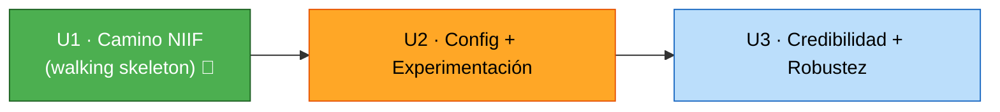

# Dependencias entre Unidades — Ratchet

## Matriz
| Unidad | Depende de | Razón |
|---|---|---|
| **U1 · Camino NIIF** | — | rebanada vertical autónoma (walking skeleton) |
| **U2 · Config + Exp** | U1 | reusa Gate (C6), Evaluator (C3), Orchestrator (C9), Adapter (C1) |
| **U3 · Credibilidad + Robustez** | U1, U2 | 2º paciente ejercita ambas ramas; revert asimétrico endurece el Gate de U1; deriva usa el Monitor de U1 |

## Orden de construcción (crítico)

## Notas de coordinación
- **Camino crítico:** U1 es bloqueante de todo — se construye y prueba **end-to-end** antes de empezar U2.
- **Reuso, no duplicación:** U2/U3 extienden componentes de U1; el Gate y el Orchestrator se construyen "completos" en U1 y solo se les añade la rama config (U2) y el revert asimétrico (U3).
- **Punto de validación de integración:** al cerrar U1, corre el escenario NIIF e2e; al cerrar U2, corre config + NIIF; al cerrar U3, ambos sobre el 2º paciente (o fallback).
- **Estrategia de rollback:** greenfield → cada unidad se integra tras pasar sus tests; si U2/U3 rompen, U1 (el no-negociable) queda intacto y demostrable.
