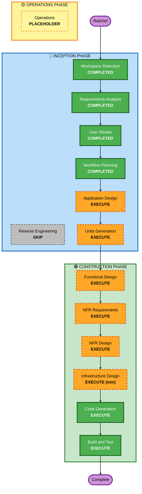

# Execution Plan — Ratchet

## Detailed Analysis Summary

### Change Impact Assessment
- **User-facing changes**: Sí — CLI/API para disparar, revisar writeups, aprobar deploys/parches (2 personas).
- **Structural changes**: Sí — nuevo sistema (monolito modular Python: API/CLI, Core Engine con módulos M1-M7, Job Runner, PostgreSQL).
- **Data model changes**: Sí — golden set (con span de fuente), baseline, historial, decisiones, writeups.
- **API changes**: Sí — nueva superficie CLI+API; contrato de adaptador (config + datos) hacia el RAG externo.
- **NFR impact**: Sí — confiabilidad/no-regresión, reproducibilidad/auditabilidad, testing (PBT parcial), agnóstico al modelo.

### Risk Assessment
- **Risk Level**: **Medium** — greenfield (rollback fácil, sin sistema legado), pero **alta exigencia de corrección** (garantías de no-regresión, gate/revert, recall determinista).
- **Rollback Complexity**: Easy (no hay producción que romper; todo versionado).
- **Testing Complexity**: **Complex** — evals deterministas + PBT sobre el núcleo + escenario end-to-end NIIF.

## Workflow Visualization

## Phases to Execute

### 🔵 INCEPTION PHASE
- [x] Workspace Detection (COMPLETED)
- [x] Reverse Engineering (SKIPPED — greenfield)
- [x] Requirements Analysis (COMPLETED)
- [x] User Stories (COMPLETED)
- [x] Workflow Planning (IN PROGRESS)
- [ ] **Application Design — EXECUTE**
  - *Rationale:* sistema nuevo con múltiples componentes (M1-M7), reglas de negocio no triviales (revert-safety, gate, localización), y capa de servicio + dependencias que definir.
- [ ] **Units Generation — EXECUTE**
  - *Rationale:* el sistema se descompone en unidades de trabajo (capacidades del loop) que se construyen una a una; la rebanada vertical NIIF debe quedar como unidad protegida.

### 🟢 CONSTRUCTION PHASE *(por unidad)*
- [ ] **Functional Design — EXECUTE**
  - *Rationale:* nuevos modelos de datos (golden set con span, decisiones) y lógica compleja (recall-por-span, gate, revert) que requieren diseño detallado.
- [ ] **NFR Requirements — EXECUTE** *(profundidad ligera)*
  - *Rationale:* NFRs por unidad (confiabilidad, reproducibilidad, PBT). El stack ya está decidido (arquitectura) → foco en las garantías, no en re-elegir tecnología.
- [ ] **NFR Design — EXECUTE**
  - *Rationale:* traducir esos NFR a patrones (gate + revert automático, versionado, idempotencia, PBT del núcleo).
- [ ] **Infrastructure Design — EXECUTE (mínimo)**
  - *Rationale:* MVP local reproducible (docker-compose: app + PostgreSQL + worker). Cloud/IaC completo **fuera de alcance** (fast-follow). *(Borderline: si prefieres, se puede SKIP y plegar el docker-compose en Code Generation.)*
- [ ] **Code Generation — EXECUTE (ALWAYS)**
  - *Rationale:* generar el código, tests y artefactos por unidad.
- [ ] **Build and Test — EXECUTE (ALWAYS)**
  - *Rationale:* build, tests unitarios/integración, PBT del núcleo y el escenario end-to-end NIIF.

### 🟡 OPERATIONS PHASE
- [ ] Operations — PLACEHOLDER (no aplica en v0.1.8)

## Estimated Timeline
- **Total de fases a ejecutar**: 2 (Inception restante) + 6 (Construction, por unidad) = **8**.
- **Duración estimada**: dentro de la ventana de 11 días a Demo Day (2026-07-13). Estrategia **walking-skeleton-first**: la unidad del **Camino NIIF** se construye y prueba primero end-to-end; el resto por prioridad.

## Success Criteria
- **Primary Goal**: el **Camino NIIF end-to-end** funcionando (entregable no-negociable, Q7).
- **Key Deliverables**: loop medir→localizar→arreglar(datos/config)→gate→aprobar; recall-por-span; writeup de incidente; reporte antes/después; CLI+API; local reproducible.
- **Quality Gates**: 0 regresiones no detectadas (cobertura del golden set); % localización ≥0.8; significancia sobre golden set ≥50; PBT verde en el núcleo determinista; 0 trampas al golden set.
