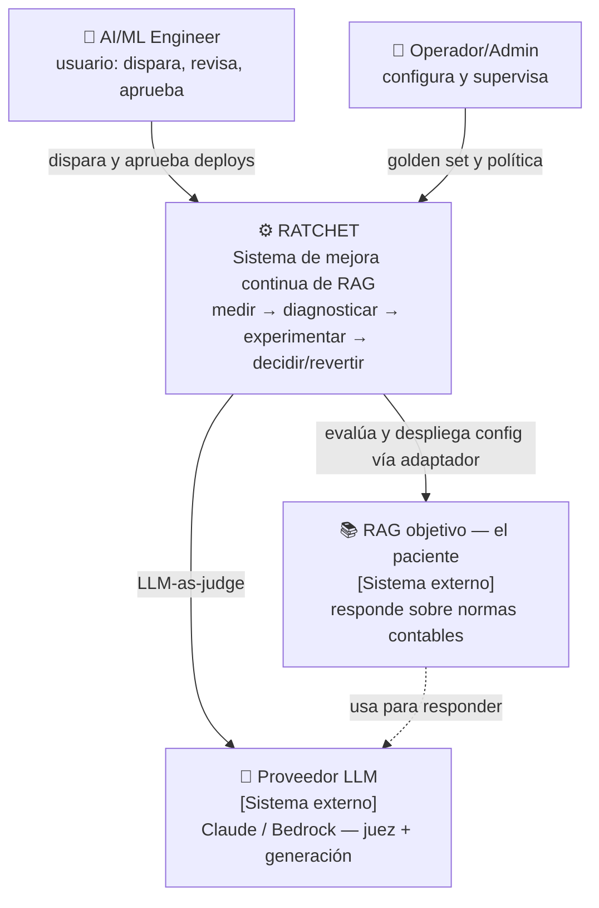
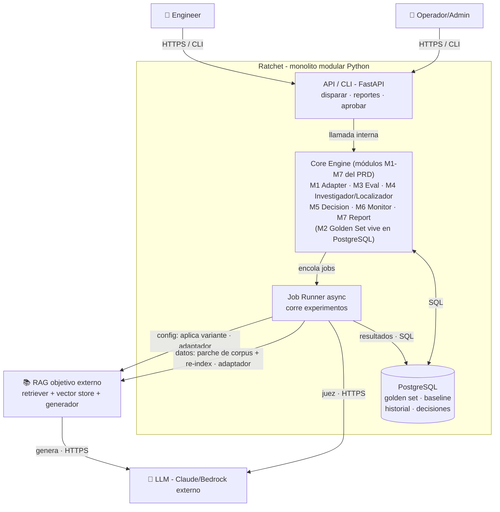

# Arquitectura — Ratchet

> Salida del **Prompt 2 (AJIT — Architecture Just-in-Time)** del pipeline AI-DLC. Co-creada segmento por segmento, actuando como Senior Solutions Architect.
> Insumo: `specs/prd.md`. Regla #1: **simplicidad sobre complejidad** (monolito modular, no 50 microservicios).
> Encuadre: MVP = monolito modular con costuras; documentamos cómo escalaría al patrón event-driven/servicios de los JD de Caseware.
> **Principio agéntico (panel 2):** la agencia (investigador/localizador que recorre el lineage) vive **río arriba del gate**; el juez y el gate son código determinista. *"Cuanto más lejos del gate, más agente; cuanto más cerca, más determinista."*
> Estado: **Arquitectura v1 COMPLETA — 4/4 segmentos (2026-07-02).** Siguiente: ADRs y/o Prompt 3 (backlog).

## Progreso de segmentos
- [x] 1. Diagrama de Contexto (C4 L1)
- [x] 2. Diagrama de Contenedores (C4 L2)
- [x] 3. Matriz de Atributos No Funcionales (NFR)
- [x] 4. Riesgos y SPOF

---

## Segmento 1 — Diagrama de Contexto (C4 Nivel 1)

### Fronteras del sistema
- **HACE Ratchet:** evaluar, generar hipótesis, experimentar, decidir con revert-safety, reportar, orquestar el loop.
- **DELEGA:** el RAG (dueño de su retrieval/generación/vector store — conectado por adaptador; se le cambia **config Y (rama de datos) se le aplican parches al corpus/índice**, sin reescribir su código); el LLM (inferencia del juez + generación del RAG).
- **NO hace:** responder al usuario final, alojar el corpus/vector DB del RAG, generar respuestas.

**Notas:** en el demo Mauricio construye el RAG, pero se modela como sistema externo (separación por el adaptador, P5). Observabilidad (LangFuse) es Should-Have → fuera del contexto core.

**Supuesto crítico del adaptador:** el RAG objetivo debe exponer control **de config Y de datos** (aplicar/revertir un parche al corpus + re-index), ambos aplicables y reversibles. En el demo se cumple (paciente local que Ratchet corre). La garantía de revert-safety aplica solo a RAGs que expongan ese control. **`TBD` (resolver antes del día 1):** (1) definir el contrato del adaptador —config + datos—; (2) **elegir el RAG open-source** del 2º paciente y validar que soporta re-index.

---

## Segmento 2 — Contenedores (C4 Nivel 2)

### Contenedores y justificación
| Contenedor | Qué es | Por qué |
|---|---|---|
| **API / CLI** | FastAPI (Python) — dispara corridas, sirve reportes, gestiona aprobaciones | Ecosistema RAG/eval es Python; FastAPI ligero y async-friendly. Superficie CLI+API (Seg. 9) |
| **Core Engine** | Los 7 módulos del PRD como módulos internos: **M1** Adapter, **M3** Eval, **M4 Investigador/Localizador** (dirige la experimentación de config), **M5** Decision, **M6** Monitor, **M7** Report; **M2 Golden Set & Registro vive en PostgreSQL** | Regla #1: monolito modular. Las costuras permiten separar en servicios después |
| **Job Runner (async)** | Corre los experimentos (N variantes × golden set) sin bloquear | Experimentos largos → async. Patrón async/worker del JD. **Skeleton: síncrono/in-process; endurecer: cola real (RQ+Redis, retry/DLQ)** |
| **PostgreSQL** | Golden set, baseline, historial, decisiones (P4) | Relacional para resultados/historial. **El vector store NO es de Ratchet** — es del RAG |

### Protocolos
HTTPS/REST (API) · adaptador HTTP/SDK (→ RAG) · HTTPS (→ LLM) · SQL (→ Postgres) · cola interna (Core → Worker).

### Decisión de stack (recomendación)
**Python-first para el MVP + gateway NestJS como fast-follow (Should-Have, días 31-60).** El músculo duro (loop/evals) es Python nativo; el NestJS del JD de Caseware se agrega después, a propósito, para tildar la casilla. No construir polyglot en 11 días (regla #1).

### Cómo escalaría al stack enterprise de los JD *(documentado, no MVP)*
- API/CLI → **NestJS API Gateway** (signal TypeScript de Caseware) delante del core Python.
- Cola interna → **SQS / EventBridge** (event-driven, DLQ, idempotencia).
- Worker → **Lambda / EKS**. Deploy → IaC (Terraform/CDK); observabilidad LangFuse.

---

## Segmento 3 — Matriz de Atributos No Funcionales (NFR)

| Atributo | Justificación según el PRD | Táctica Arquitectónica |
|---|---|---|
| **1. Confiabilidad / Corrección** *(decidir bien y seguro, en el momento)* | Identidad del producto. Guardrail = 0 regresiones; P1, P3. Un falso negativo = incidente | Gate de no-regresión + **revert automático**; **anclar en `recall` determinista** (no solo juez); aprobación humana para avanzar |
| **2. Reproducibilidad / Auditabilidad** *(re-verificar la decisión, después)* | P4; "eval-the-evaluator"; sin poder auditarlo, la autonomía es inaceptable | **Versionar** golden set + config + resultados; historial; **recomputar** métricas deterministas; corridas idempotentes |
| **3. Extensibilidad / Mantenibilidad** | Roadmap a plataforma; P5 (agnóstico) | Monolito modular con límites claros; **interfaces de adaptador** (RAG/LLM/store por config); costuras para separar en servicios |

**Lo que NO está en el top-3** (juicio de arquitecto): escalabilidad (MVP = un RAG, roadmap); latencia/rendimiento (sistema de fondo, sin SLA; acotado por limitar variantes); costo (mitigado por la política + nº de variantes).

---

## Segmento 4 — Puntos Únicos de Falla (SPOF) y Contingencias

| SPOF | Qué pasa si falla | Plan de contingencia |
|---|---|---|
| **Proveedor LLM** (juez + generación) | Sin juez → no faithfulness; sin generación → el RAG no responde | Retry + backoff; circuit breaker + timeout; **degradar a solo `recall`** (determinista, no necesita LLM); marcar faithfulness "inconcluso"; gestión de secrets/keys |
| **RAG objetivo caído** | No se puede evaluar ni experimentar | Retry; marcar corrida inconclusa; **no decidir con datos incompletos** → mantener baseline (P1) |
| **PostgreSQL** (golden set/historial/decisiones) | Se detiene todo; riesgo de perder datos | Backups + migraciones versionadas; en prod RDS Multi-AZ; integridad del baseline vigilada |
| **Job Runner / Worker** muere a mitad | Se pierde el progreso del experimento | Jobs idempotentes y reanudables; retry / DLQ (fase endurecer); en skeleton síncrono el fallo es visible y se re-corre |
| **El monolito (API + Core) — proceso único** | Si el proceso muere, todo se cae — tradeoff honesto del monolito | **Stateless** (estado en Postgres) → reinicio/redeploy rápido; en prod múltiples instancias tras LB + health checks |
| **Deploy de config al RAG falla a medias** | El RAG queda en estado inconsistente | **Aplicación atómica** + **verificación post-deploy** (M7→M3) + **revert** si falla (P1) |
| 🎯 **Golden set / baseline corrupto o sesgado** *(el más peligroso)* | Garbage in → todas las decisiones malas, en silencio | **Versionar + validar** el golden set; revisión humana; held-out; se detecta al recomputar |
| **Sobre-confianza en el LLM-judge** | Si solo el juez decide y se equivoca → decisiones malas | **Anclar en `recall` determinista** → el juez NO es un SPOF de la decisión principal (mitigación de diseño) |

**Por diseño (no es SPOF):** el gate humano (P2) es un cuello de botella deliberado — si el aprobador no está, nada avanza pero **nada se rompe** (Journey 3). Es seguridad, no fragilidad.

**Insight de arquitecto:** el SPOF más peligroso **no es de infra, es de DATOS** (golden set/baseline) — coherente con la tesis Data-Centric y el riesgo #3 del PRD.
