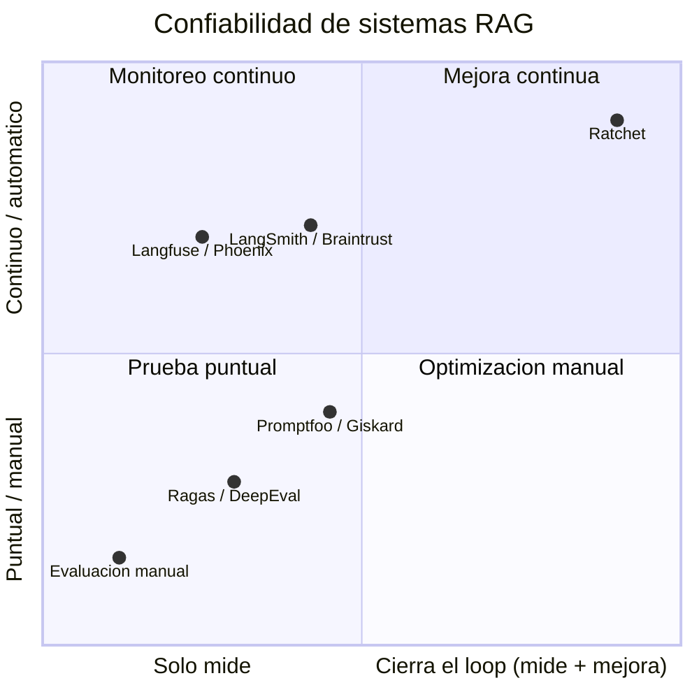
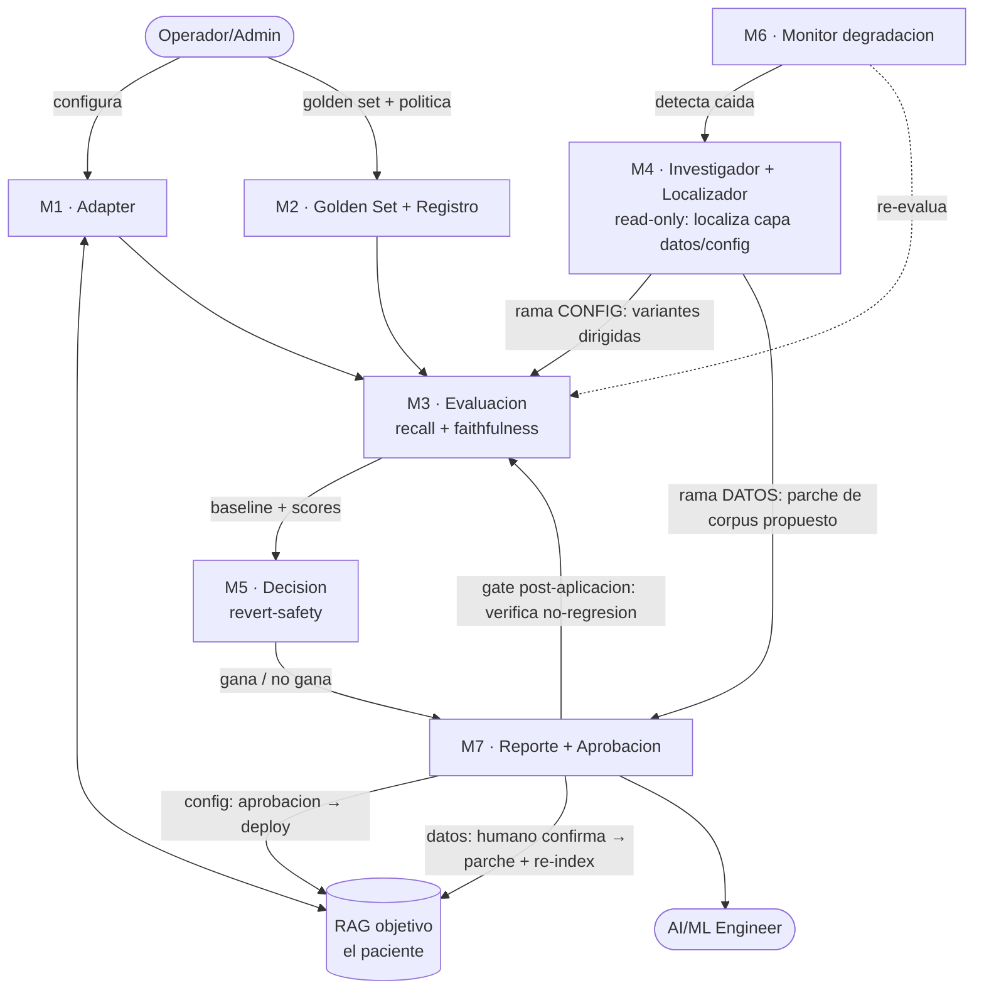

# PRD — Ratchet

> Salida del **Prompt 1** del pipeline AI-DLC. Co-creado **segmento por segmento**, human-in-the-loop.
> Insumos: `docs/definicion.md` (estrella polar), `docs/overview.md`, `docs/pvb.md`, `docs/icp.md`, `docs/mercado.md`, `docs/critica.md`.
> Estado: **PRD v1 COMPLETO — 13/13 segmentos (2026-07-02).** Siguiente: Prompt 2 (Arquitectura).

## Progreso de segmentos
- [x] 1. One-Liner del Producto + JTBD
- [x] 2. Contexto y Problema
- [x] 3. ICP Detallado
- [x] 4. Propuesta de Valor Única (UVP) y Diferenciadores
- [x] 5. Casos de Uso Top 5
- [x] 6. Principios de Diseño No Negociables
- [x] 7. User Journeys
- [x] 8. MVP Scope (MoSCoW)
- [x] 9. Especificación Funcional: Módulos y Features
- [x] 10. Métricas de Éxito
- [x] 11. Plan de Evaluación del Agente
- [x] 12. Riesgos y Mitigaciones
- [x] 13. Plan de Entrega 30/60/90 días

---

## Segmento 1 — One-Liner del Producto + JTBD

### Frase de producto
**Ratchet** es el **SRE de guardia del conocimiento de un RAG**: cuando la confiabilidad cae, **localiza en qué capa está el defecto —datos o config—** recorriendo el lineage, escribe el diagnóstico y lo arregla en la capa correcta (config con gate; datos con confirmación humana). Como un trinquete, **la calidad solo avanza — nunca retrocede por un cambio propio.**

### JTBD principal
**Cuando** corro un asistente RAG en producción y sus documentos y modelos cambian con el tiempo, **quiero** saber si sigue siendo confiable y mejorarlo automáticamente sin arriesgarme a empeorarlo, **para** que no se degrade en silencio ni pierda la confianza de mis usuarios.

### Misión del producto
Que un asistente de IA en producción **no empeore sin que nadie lo note ni lo arregle**. Ratchet convierte la confiabilidad de la IA en un **proceso continuo y medible** —no en una prueba de una sola vez— aplicando el principio de mejora continua (Data-Centric AI): **previene regresiones, localiza el defecto (datos o config) y lo arregla en la capa correcta**, con las garantías en código determinista. La calidad **avanza o se mantiene; no retrocede por un cambio propio**.

---

## Segmento 2 — Contexto y Problema

### Dolores del mercado
1. **El RAG se degrada en silencio tras lanzar.** Cambian los documentos (sale una modificación a una norma), cambia la versión del modelo, crece el corpus, aparecen preguntas nuevas → lo que salió confiable cae con el tiempo y nadie lo nota. *(Ilustrativo: ~90% de precisión al lanzar → ~75% en meses. Cifra ejemplo, no medida — `TBD` baseline real.)*
2. **La prueba es de una sola vez y manual.** Se valida antes de lanzar (notebooks, sets ad-hoc), se afina a mano, se publica. Es una foto, no un proceso → no atrapa la degradación posterior.
3. **Miden, pero no auto-mejoran.** Aun con dashboards que dicen "recall 0.70", un humano tiene que diagnosticar la causa y ajustar a mano. El loop que arregla solo (y revierte si empeora) casi nadie lo construye.

**Señal de mercado (por citar):** Gartner *proyecta* que **>40% de los proyectos de agentic AI podrían cancelarse hacia fin de 2027** por costos crecientes, valor poco claro o controles de riesgo insuficientes; advierte sobre "agentwashing". *(Fuente: `docs/mercado.md` — `TBD`: **citar el informe Gartner exacto antes del Demo Day**; si no se verifica, degradar a "se proyecta" con fuente secundaria.)*

### ¿Por qué ahora?
- **Ola de despliegue de agentes/RAG en empresas (2025-2026):** cientos de asistentes saliendo a producción, pero la capa de confiabilidad/operación no maduró al mismo ritmo → brecha.
- **Dominios regulados y de alto riesgo** (contabilidad/auditoría, banca, legal) no toleran la degradación silenciosa: una norma mal citada es un error con consecuencia.
- **La ola de cancelaciones (Gartner) ya está pegando ahora** → el mercado choca con el muro de confiabilidad en este momento.

### Alternativas actuales (qué usa el ICP hoy y por qué es insuficiente)
| Alternativa | Qué es | Por qué es insuficiente |
|---|---|---|
| Evaluación manual de una vez | Sets de prueba ad-hoc al construir | Foto puntual; no ve la degradación post-lanzamiento |
| Herramientas de eval/observabilidad (LangSmith, Braintrust, Langfuse, Phoenix, Ragas…) | Miden y observan calidad/trazas | Sobre todo miden; el humano diagnostica y afina a mano; rara vez cierran el loop de auto-mejora con revert |
| No hacer nada / esperar | Lo más común | Degradación silenciosa hasta que un usuario se queja |

**El hueco:** todas **miden**; ninguna **mejora de forma continua y automática protegiendo contra regresiones.** Ahí entra Ratchet.

---

## Segmento 3 — ICP Detallado

> ⚠️ **ICP hipotético:** sin entrevistas de clientes, son hipótesis del análisis, no validado en campo. Encuadre de portafolio: el "cliente" real es el mercado laboral (empresas que contratan Senior AI Eng, p. ej. Caseware); el "usuario del producto" es a quién le serviría Ratchet.

### Perfil y firmographics (el corte que importa)
No es "cualquier empresa con un RAG". Es específicamente quien **no puede hacer "set and forget"**:
- **Corte clave:** equipos cuyo RAG vive sobre un **corpus que CAMBIA** (documentos regulados/versionados) **Y** donde una **respuesta errónea cuesta** (regulatorio, financiero, confianza).
- **Sector:** auditoría/contabilidad, banca, fintech, seguros, legal, salud. *Demo: contabilidad → Caseware.*
- **Tamaño:** con función de IA/plataforma dedicada → mid-market a enterprise (o scale-up bien financiado). `TBD` cifras.
- **Geografía:** global.
- **Anti-ICP:** un chatbot de FAQ estático, sobre corpus que nunca cambia y de bajo riesgo. No necesita Ratchet.

### Buyer personas (roles que deciden)
- **Campeón técnico / usuario:** AI/ML Engineer o AI Platform Lead dueño del asistente RAG.
- **Decisor:** Head of AI / Engineering Manager / CTO (responde por confiabilidad y presupuesto).

### Pains
- **Negocio** (Seg. 2, `docs/definicion.md`): degradación silenciosa post-lanzamiento; prueba de una sola vez; medir sin auto-mejorar.
- **Ingeniero (dolor diario):** "apago incendios y afino a mano"; "no me atrevo a cambiar el chunking/modelo porque no sé si rompo algo"; "no tengo forma sistemática de saber si mi RAG sigue siendo bueno".

### Triggers de compra
- Incidente: respuesta desactualizada/errónea que alguien notó.
- Actualización grande del corpus o cambio de modelo → "¿se rompió algo?".
- Handoff/rotación: nadie recuerda cómo se afinó el RAG.
- Presión de dirección por gobernanza/confiabilidad de IA.

### Objeciones probables y cómo responderlas
| Objeción | Respuesta |
|---|---|
| "Ya tenemos LangSmith / evals." | No reemplaza la medición; cierra el loop (diagnostica, experimenta, aplica con revert-safety). Medir ≠ mejorar. |
| "¿No es riesgoso que mi RAG cambie solo?" | Nunca empeora (revert) + aprobación humana en el deploy. |
| "¿Un LLM no hace esto?" | No: requiere pipeline + estado + experimentación repetible. |
| "Es muy específico de un dominio." | El loop es horizontal; demo en contabilidad, aplica a banca/fintech. |

### Verbatims
`N/A` — sin transcripciones. `TBD` si se hacen.

---

## Segmento 4 — UVP y Diferenciadores

### ¿Qué problema resuelve? ¿Para quién? ¿Cómo?
- **Problema:** los asistentes RAG en producción se degradan en silencio y los equipos solo miden, no mejoran de forma continua y segura.
- **Para quién:** el equipo de IA/plataforma dueño de un RAG sobre corpus cambiante y de alto riesgo (Seg. 3).
- **Cómo:** el loop **medir → investigar el lineage y localizar la capa del defecto (datos o config) → arreglar en la capa correcta (experimentar config / proponer parche de datos) → decidir (gate / revertir)**, con aprobación humana. Garantía del trinquete: nunca empeora.

### UVP (una frase)
> *"Ratchet no auto-afina tu RAG a ciegas: cuando cae la confiabilidad, **localiza el defecto en el lineage y te dice si el problema son tus datos o tu config** — y garantiza que ningún cambio lo deje peor."*

### Diferenciación vs. competidores
El diferencial real no es "ellos no pueden medir ni experimentar" (sí pueden). Son **dos cosas encadenadas**: (1) el **investigador read-only que recorre el lineage y localiza la capa del defecto (datos vs config)** — nadie más lo hace; y (2) la **autonomía del ciclo decidir→desplegar→revertir, de forma continua**. Localizar la capa es lo que hace que el fix sea el correcto (y lo que permite atacar el escenario bandera —doc fuente desactualizado— que *ninguna perilla arregla*).

| | Eval/observabilidad (LangSmith, Braintrust, Langfuse, Phoenix, Ragas…) | **Ratchet** |
|---|---|---|
| Medir calidad | ✅ | ✅ |
| Correr experimentos/comparaciones | ⚠️ sí, pero el humano los lanza e interpreta | ✅ el sistema los genera y corre |
| **Localizar la capa del defecto (datos vs config) recorriendo el lineage** | ❌ | ✅ **el corazón agéntico** |
| Generar hipótesis de mejora (dirigidas por la localización, no a ciegas) | ❌ humano | ✅ |
| Decidir + desplegar + revertir de forma autónoma (nunca empeora) | ❌ | ✅ |
| Continuo (no puntual) | ⚠️ monitorean | ✅ mejoran |

> *Honesto (alcance del MVP):* la **localización de la capa** es en su mayoría un procedimiento **determinista de 5 vías** (¿span en top-k? ¿indexado? ¿partido? ¿sigue en el corpus? ¿se ignoró en la generación?); el LLM **redacta el writeup y prioriza qué perilla probar**, no decide la capa por su cuenta. Es diagnóstico causal **acotado y verificable**, no razonamiento causal profundo abierto. Coherente con CU-4 y el MVP (Seg. 8) — *"el razonamiento propone, la matemática dispone"*.

### Brecha de mercado
Todos miden; nadie cierra el loop decidir→desplegar→revertir de forma continua y segura. Esa es la brecha que Ratchet llena. *(Para portafolio: tesis a demostrar, no claim validado.)*

### Matriz de posicionamiento 2x2

Ratchet queda solo en el cuadrante arriba-derecha (cierra el loop + continuo).

---

## Segmento 5 — Casos de Uso Top 5

### CU-1 · Bloquear una regresión ante un cambio deliberado 🟢 *core MVP*
- **Actor:** AI/ML Engineer.
- **Trigger:** yo voy a desplegar un cambio (nuevo chunking, modelo, corpus actualizado).
- **Steps:** (1) el cambio dispara evaluación contra el golden set → (2) compara vs. baseline → (3) si una métrica clave cae, bloquea el deploy y avisa → (4) el ingeniero revisa el reporte.
- **Resultado:** ningún cambio que empeore la calidad llega a producción.
- **KPI:** % de regresiones atrapadas; 0 regresiones no detectadas.

### CU-2 · Subir el retrieval automáticamente 🟢 *core MVP (el corazón)*
- **Actor:** AI/ML Engineer.
- **Trigger:** una evaluación muestra recall/faithfulness bajo el umbral (corrida manual o del CU-3).
- **Steps:** (1) agrupa las fallas y genera hipótesis (chunk size, híbrido, reranker) → (2) corre cada variante contra el mismo golden set → (3) elige la ganadora según la política (métrica + costo/latencia) → (4) la propone con reporte → (5) humano aprueba y despliega.
- **Resultado:** el asistente mejora sin que un humano afine a mano.
- **KPI:** recall/faithfulness antes→después (ej. 0.70→0.88).

### CU-3 · Cazar la degradación silenciosa (sin que yo toque nada) 🟢 *core MVP — el diferencial*
- **Actor:** AI/ML Engineer (recibe la alerta).
- **Trigger:** el mundo cambia solo — se actualiza un documento del corpus / cambia la versión del modelo. *(Distinto de CU-1: ahí el cambio lo hago yo; aquí pasa sin que lo toque.)*
- **Steps:** (1) Ratchet re-evalúa contra la línea base histórica → (2) detecta la caída → (3) abre alerta con el modo de falla → (4) dispara CU-2.
- **Resultado:** la degradación se detecta en la siguiente evaluación, no cuando se queja un usuario.
- **KPI:** tiempo-a-detección de degradación.
- *MVP mínimo:* demostrar un ciclo (simular una actualización que degrada → Ratchet la caza). Scheduling completo = roadmap.

### CU-4 · Investigador que localiza el defecto (datos vs. config) 🟢 *core MVP — el corazón agéntico (panel 2)*
- **Actor:** el sistema (agente investigador **read-only**) → AI/ML Engineer revisa.
- **Trigger:** una evaluación muestra fallas.
- **Steps:** (1) investiga con **herramientas** sobre datos que ya loggeas (sonda de retrieval; ¿el span dorado está indexado?; fronteras de chunk) → (2) **localiza la capa del defecto** (retrieval / chunking / **fuente desactualizada** / hueco de cobertura / generación) → (3) escribe un **writeup de incidente** con evidencia → (4) prescribe el fix en la capa correcta: **config** (dispara CU-2 dirigido → gate) o **datos** (propone parche → **humano confirma** → aplica → **gate post-aplicación: M7 re-evalúa, revert si empeora**).
- **Resultado:** juicio sobre **DÓNDE** está el problema, como un ingeniero senior — no un for-loop de perillas. Un for-loop nunca concluye "el span no está en el corpus, no hay perilla que lo arregle".
- **Cómo distingue la capa (determinista donde se puede):** *retrieval miss* = el span dorado no está en top-k pero SÍ indexado; *chunking* = el span quedó partido entre chunks; *fuente vieja* = el span dorado ya no está/difiere en el corpus; *cobertura* = ningún chunk cubre el tema; *generación* = el span se recuperó pero la respuesta lo ignora.
- **KPI:** % de localizaciones correctas; **0 acciones que hagan trampa al golden set**.

### CU-5 · Rendir cuentas de confiabilidad al decisor 🟡 *roadmap*
- **Actor:** Head of AI / CTO.
- **Trigger:** revisión periódica o auditoría de gobernanza de IA.
- **Steps:** (1) abre el scorecard → (2) ve la tendencia de calidad y qué cambió → (3) exporta el reporte con trazabilidad.
- **Resultado:** confiabilidad demostrable y auditable.
- **KPI:** % de cambios con trazabilidad completa; tiempo para producir el reporte de auditoría.

---

## Segmento 6 — Principios de Diseño No Negociables

### P1 · Nunca empeorar (el trinquete) 🔒
- **(a) Operativo — dos tipos de regresión, dos respuestas:**
  - (i) **Gate:** un cambio hacia adelante solo se aplica si supera al baseline (gate automático de no-regresión).
  - (ii) **Regresión por un cambio que Ratchet desplegó** → **revert automático** a la última versión buena (no pide permiso).
  - (iii) **Degradación por deriva del entorno** (cambió el corpus/modelo, no Ratchet) → **NO hay revert** (no hay versión a la que volver); se **detecta y se dispara re-experimentación** (CU-2).
  - El "nunca empeora" aplica a **lo que Ratchet controla** (sus deploys); ante la deriva, Ratchet **detecta y recupera**.
- **(b) Se manifiesta:** reporte antes vs. después; deploy deshabilitado si la variante no gana; **revert** disponible para regresiones de un deploy propio; **re-experimentación** ante deriva del entorno. **Ambas ramas —cambio de config y parche de datos— pasan por el gate post-aplicación** (M7 re-evalúa contra el golden set; si empeora, revert).
- **(c) PROHIBIDO:** aplicar un cambio sin comparar contra baseline; dejar una regresión activa; exigir aprobación para volver a lo seguro.

### P2 · Humano aprueba lo que AVANZA a producción
- **(a) Operativo:** el sistema evalúa, experimenta y recomienda autónomo; un cambio hacia adelante a producción exige aprobación humana explícita. Asimetría: avanzar = humano; revertir a lo seguro = automático.
- **(b) Se manifiesta:** estado "aprobación pendiente" con reporte de evidencia; nada avanza solo.
- **(c) PROHIBIDO:** desplegar hacia adelante sin aprobación; auto-aplicar mejoras en prod sin gate humano.

### P3 · Evidencia medible, no vibes (Data-Centric)
- **(a) Operativo:** toda decisión se respalda con métricas sobre un golden set versionado. Métrica determinista (recall) → verificada con código; métrica subjetiva (faithfulness) → LLM-judge; nunca al revés.
- **(b) Se manifiesta:** cada recomendación trae su evidencia (métricas antes/después, casos arreglados y rotos).
- **(c) PROHIBIDO:** decidir sin evidencia; usar solo LLM-judge donde hay verificación determinista.

### P4 · Reproducible y trazable
- **(a) Operativo:** golden set, configuraciones y resultados versionados; cada corrida deja rastro (config, datos, resultado).
- **(b) Se manifiesta:** historial de experimentos y decisiones; re-correr una evaluación pasada da lo mismo.
- **(c) PROHIBIDO:** cambios sin registro; evaluaciones no reproducibles; borrar el historial.

### P5 · Agnóstico al modelo y al framework (sin sobre-ingeniería)
- **(a) Operativo:** el core se comunica con el RAG objetivo, el LLM y el vector store por costuras (adaptadores/interfaces). El MVP implementa UNA opción concreta de cada uno, pero la costura permite reemplazar sin tocar el core.
- **(b) Se manifiesta:** configuración de adaptador/modelo/store; el core no cambia al cambiar el proveedor.
- **(c) PROHIBIDO:** hardcodear un proveedor en el core (saltarse la costura).

---

## Segmento 7 — User Journeys

**Personas:** *Usuario final* = AI/ML Engineer (dueño del RAG, recibe el valor). *Operador/admin* = quien configura y supervisa (el mismo ingeniero en setup, o el Team Lead).
> **Orden lógico:** J2 (setup) es prerrequisito de J1 (valor). El curso pide el usuario final primero, pero en la vida real primero se configura.

### Journey 1 — Happy Path del usuario final (AI/ML Engineer)
1. Dispara una evaluación de su RAG (a mano o programada) → Ratchet detecta que el recall está por debajo del umbral objetivo (sea en la primera medición o porque cayó con el tiempo).
2. Ratchet **investiga y localiza el defecto** (¿datos o config?), escribe el **writeup de incidente**, y —si es config— corre los experimentos dirigidos (asíncrono, minutos). El ingeniero abre el writeup: la **capa del defecto + evidencia**, y la recomendación (config: híbrida + chunk 256 → recall 0.70→0.88; o datos: parche propuesto).
3. Revisa la evidencia: qué casos arregló, cuáles no tocó, costo y latencia extra.
4. Aprueba (**un comando / CLI**; el dashboard es Should-Have).
5. Ratchet despliega la nueva config y confirma que no hubo regresión. El asistente quedó mejor sin que él afinara nada a mano.

### Journey 1-B — Happy Path rama de DATOS (el escenario bandera)
1. Cambia una norma (ej. NIIF 16); el asistente empieza a citar la versión vieja.
2. M6 caza la caída de recall; M4 **investiga y localiza** que la causa NO es retrieval sino un **documento fuente desactualizado** (el span dorado ya no está en el corpus).
3. M4 escribe el **writeup**: *"el recall cayó porque el doc X quedó viejo tras el cambio de NIIF 16; ninguna perilla lo arregla; propongo reemplazarlo por la versión vigente."*
4. El ingeniero **confirma** el parche; Ratchet reemplaza el doc + re-index.
5. **M7 re-evalúa** contra el golden set; recall recupera; si hubiera empeorado, **revert automático** (P1).

### Journey 2 — Happy Path del operador/administrador (setup y supervisión)
1. Conecta su RAG a Ratchet mediante el adaptador (endpoint/SDK).
2. Carga o define el golden set (pregunta + respuesta correcta + **span de fuente esperado**).
3. Define la política: métrica objetivo (recall), umbral, qué perillas puede experimentar (chunk size, híbrido, reranker), regla de decisión (tope de costo/latencia) y quién aprueba los deploys.
4. Ratchet corre la evaluación baseline y fija la línea de referencia.
5. Supervisa **vía reporte/CLI** (el dashboard es Should-Have) y aprueba las mejoras cuando llegan.

### Journey 3 — Edge Case 1: flujo interrumpido / el humano no responde
- **Interrupción técnica:** una variante falla (API del LLM caída / timeout).
  1. Ratchet reintenta (retry).
  2. Si persiste, marca la variante como "inconclusa" (no la puntúa) y sigue con las demás.
  3. Nunca decide con datos incompletos: sin ganadora con evidencia completa, mantiene el baseline.
  4. Deja el experimento parcial/reanudable, con el error registrado.
- **El humano abandona:** si hay una mejora en "aprobación pendiente" y nadie responde, nada se despliega (P2); queda pendiente.

### Journey 4 — Edge Case 2: Ratchet no puede resolver → escala a un humano
1. Detecta baja calidad, genera hipótesis y experimenta, pero ninguna variante supera al baseline.
2. No aplica ningún cambio (P1); el baseline se mantiene.
3. Escala al humano con un reporte honesto: "no encontré una mejora automática."
4. Adjunta los modos de falla + las hipótesis que probó y por qué fallaron.
5. Sugiere próximos pasos de juicio humano: revisar/ampliar el corpus, nuevas hipótesis, ajustar el golden set.
- **Resultado:** el sistema no finge; escala con evidencia.

---

## Segmento 8 — MVP Scope (MoSCoW)

> 🎯 **Héroe del demo:** el **escenario de datos (NIIF)** end-to-end — cazar la caída → localizar que la causa es un documento fuente desactualizado (no retrieval) → writeup → parche → humano confirma → re-index → recall recupera con significancia. **Evidencia de apoyo:** la rama config (recall 0.70→0.88 automático) que prueba el **gate de no-regresión + revert-safety**. Sobre corpus contable. *(Un héroe + reparto de apoyo, no dos héroes — coherente con Seg. 13 y el reencuadre del panel 2.)*

### ✅ Must Have — con prioridad interna
**🦴 Walking skeleton** *(refinado por auditoría de panel de expertos, 2026-07-02):*
1. **DOS pacientes:** el RAG que tú construyes (para desarrollar) **+ un RAG open-source real de terceros** — para que la mejora **no salga de un paciente amañado**. Ambos vía adaptador (seam de P5). Corpus contable. *(El 2º paciente = un RAG open-source que corres **localmente** → es configurable [deploy/revert funciona] pero sus fallas son **orgánicas**, no amañadas. `TBD`: elegir cuál. El contrato de adaptador para un RAG externo de producción sigue roadmap.)*
2. **Golden set ≥50** preguntas, **etiquetadas por span de fuente** (el lugar exacto de la respuesta en el documento, NO el chunk) + una **clase crítica** marcada. Drafting asistido por LLM, **verificado a mano**.
3. **Evaluación `recall` por span** (un chunk recuperado "acierta" si **cubre el span dorado** → así es comparable entre chunkings) + **significancia** (¿la mejora es real o ruido?).
4. **🆕 Investigador read-only (el corazón agéntico):** con **herramientas** sobre datos que ya loggeas (sonda de retrieval; ¿el span dorado está indexado?; fronteras de chunk), **localiza la capa del defecto** (retrieval / chunking / **fuente vieja** / cobertura / generación) y escribe un **writeup de incidente**.
5. **Dos ramas de fix (ambas pasan el gate post-aplicación):** **config** → experimentación dirigida → gate; **datos** (ej. doc viejo tras cambio de norma) → **parche propuesto → humano confirma → aplica → M7 re-evalúa contra el golden set → si empeora, revert automático**. *(Versión delgada en MVP: reemplazar el doc por su versión nueva + re-index; curación rica = roadmap.)*
6. **Decisión + revert-safety (P1):** gate (no despliega si no gana, **con significancia**) → **humano aprueba**. *(Garantía del demo: el **gate**; rollback en vivo = roadmap.)*
7. **Reporte/writeup** en lenguaje de dominio + antes/después **con margen de error**.

**🔧 Endurecer** *(Must, pero DESPUÉS del skeleton):*
8. **Faithfulness (LLM-judge)** — enriquece la eval. Si el tiempo aprieta → Should.
9. **Gate de no-regresión (CU-1) + aprobación humana (P2).**
10. **Detección de degradación mínima (CU-3)** — simular actualización que degrada → cazarla.
11. **Trazabilidad:** logging de cada corrida (versionado completo → Should).

### 🟡 Should Have
- Dashboard visual (v1 = reporte CLI/Markdown).
- Scheduling continuo (cron); v1 se dispara manual.
- Observabilidad (LangFuse).
- Experimentar el prompt del generador (no solo retrieval).
- Versionado formal de golden set/config.

### 🔵 Could Have
- CU-5 (scorecard ejecutivo). *(CU-4 diagnóstico causal pasó a Must — es el corazón agéntico.)*
- Más adaptadores (LangChain, OpenAI Agents SDK, ingesta de trazas).
- Multi-RAG / flota; otros módulos (Data Quality, Memory); despliegue AWS completo.

### ⛔ Won't Have (por ahora) — y por qué
| Fuera del MVP | Por qué |
|---|---|
| Evaluar agentes cerrados de terceros | Imposible sin acceso (física del problema). |
| UI pulida / multi-tenant / auth | No aporta a la tesis; come tiempo. |
| Auto-ML exhaustivo de hiperparámetros | Un barrido acotado basta. |
| Corpus enorme / muchos dominios | Un corpus contable pequeño basta. |
| Plataforma AgentOps completa (5 módulos) | Es la visión, no el MVP. |
| **Multi-agente (debate/panel de agentes)** | Teatro + no-determinismo; el juez y el gate son **código** (auditoría de panel). |
| **Planificador sofisticado (Bayesian/bandit)** | El espacio de perillas es chico; el **diagnóstico que poda el barrido** basta. |
| **Deploy sin humano** | Contradice P2; en dominio regulado es un **pasivo**, no un feature. |
| **Curación autónoma de datos/golden set (sin humano)** | Puede corromper la fuente de verdad (SPOF #1); el parche de datos = propuesta + **confirmación humana**. |
| **Lineage a nivel de embedding** | El espacio de embeddings es caja negra; el lineage honesto es fuente→chunk→retrieve→gen. |

---

## Segmento 9 — Especificación Funcional

### Módulos funcionales
| Módulo | Features principales | Roles/permisos | Flows |
|---|---|---|---|
| **M1 · Target Adapter** | Conecta el RAG vía `run(input)→salida`; una implementación en MVP; captura resultado | Operador configura | J2 |
| **M2 · Golden Set & Registro** | Gestiona golden set (pregunta + respuesta + **span de fuente esperado**); guarda baseline; historial (P4) | Operador define/carga | J2; trazabilidad |
| **M3 · Motor de Evaluación** | Corre el RAG sobre el golden set; `recall` **por span de fuente** (determinista) + faithfulness (LLM-judge); scorecard | Sistema (disparado por Engineer o M6) | J1·1; baseline J2·4 |
| **M4 · Investigador + Localizador** | **Investiga con herramientas** (sonda retrieval, ¿span indexado?, fronteras de chunk), **localiza la capa del defecto** (datos vs config) y escribe el writeup; **config** → propone variantes dirigidas (M3 las evalúa); **datos** → propone parche (humano confirma) | Sistema (read-only, propone) + Engineer revisa | J1·2; CU-4; J3 |
| **M5 · Motor de Decisión** (core) | Compara variantes vs baseline según política; elige ganadora o mantiene baseline; gate de no-regresión + revert (P1) | Sistema; política del Operador | J1; J4 |
| **M6 · Monitor de Degradación** | Re-evalúa (manual/programado); detecta caída vs baseline histórico; alerta y dispara M4 | Sistema; Engineer recibe alerta | CU-3; J1·1 |
| **M7 · Reporte y Aprobación** | Reporte con evidencia (antes/después, casos arreglados/rotos); gate de aprobación humana (P2); deploy/revert | Engineer aprueba; sistema ejecuta | J1·3-5; J4 |

**Superficie:** los módulos se exponen vía **CLI + reportes (Markdown/JSON) + API**, no por pantallas. El dashboard visual es Should-Have (Seg. 8). La única interacción humana real es aprobar/rechazar (M7).

### Arquitectura funcional (alto nivel)

**Lectura del loop:** M6 detecta caída → **M4 investiga, localiza la capa y propone** (variantes de config **o** parche de datos) → **M3 evalúa** cada variante → M5 decide (revert-safety) → M7 reporta + pide aprobación → aplica al RAG (config o parche) → M7 verifica no-regresión con M3 (revert si empeora) → M6 sigue vigilando.

---

## Segmento 10 — Métricas de Éxito

### ⭐ North Star
**Puntos de la métrica objetivo (recall por span de fuente) que el loop gana sobre el baseline, sin tuning manual.**
- Demo: **+18 pts** (0.70 → 0.88), logrado por el loop.
- 🔒 **Guardrail no negociable:** **0 regresiones no detectadas** *dentro de la cobertura del golden set / clase crítica marcada* (ver Seg. 11 — en MVP la cobertura es parcial). *(Si el guardrail se rompe, el North Star no cuenta.)*
- **Claim honesto (panel):** el producto *previene regresiones y **localiza el defecto (datos o config), arreglándolo en la capa correcta*** — **NO** "nada se degrada en silencio". Toda mejora se reporta **con margen de error / significancia** sobre un golden set **≥50**.

### KPIs
> Portafolio, sin base de usuarios → "retención" = N/A; "activación" se reinterpreta; baselines ilustrativos (`TBD` con datos reales).

| Categoría | KPI | Baseline | Meta |
|---|---|---|---|
| Activación | Tiempo de setup (RAG + golden set + baseline) | N/A | < 30 min |
| Activación | Tiempo al primer ciclo de mejora completo | N/A | < 1 día |
| Cobertura | Nº de perillas que el loop experimenta *(el diagnóstico poda → pocas variantes, no producto cartesiano)* | 0 | ≥ 3 (chunk_size, retrieval vector/híbrido, reranker on/off) |
| Continuidad (demo) | Nº de ciclos que corre el loop | 0 | ≥ 2 (mejorar + cazar degradación) |
| Calidad del RAG | recall **por span de fuente** | 0.70 *(ej.)* | ≥ 0.85 *(demo ilustra 0.88; reportar con margen de error)* |
| Calidad de Ratchet | **Significancia de la mejora** (¿real o ruido?) | — | mejora significativa (bootstrap CI / test pareado) sobre golden set **≥50** |
| Calidad de Ratchet | **% de localizaciones correctas** (¿acertó la capa del defecto?) + **0 trampa al golden set** | — | ≥ 0.8 / **0** |
| Calidad del RAG | faithfulness | `TBD` | ≥ 0.85 *(Must; baja a Should si aprieta, Seg. 8)* |
| Guardrail | Latencia/costo tras la mejora | baseline | ≤ tope de la política |
| Calidad de Ratchet | Acuerdo LLM-judge vs. humano (accuracy / kappa) | `TBD` | accuracy ≥ 0.85 / kappa ≥ 0.7 |
| Calidad de Ratchet 🔒 | **Regresiones no detectadas** (dentro de la cobertura) | — | **0** *(falso negativo = incidente; cobertura parcial en MVP, Seg. 11)* |
| Calidad de Ratchet | Precisión de recomendación (gana en held-out) | `TBD` | ≥ 0.85 *(ojo: golden set pequeño = ruido)* |

### Métricas de calidad del agente (factualidad / utilidad / seguridad)
- **Factualidad:** faithfulness del RAG (no alucina) + los reportes de Ratchet se basan solo en datos medidos (no inventa mejoras).
- **Utilidad:** las mejoras propuestas son reales → mejora neta positiva de la métrica objetivo.
- **Seguridad:** 🔒 **0 regresiones a producción** (revert-safety, P1) + la mejora no dispara costo/latencia sobre el tope. Nunca empeora.

---

## Segmento 11 — Plan de Evaluación del Agente

> **El agente a evaluar aquí es Ratchet**, no el RAG — "¿quién evalúa al evaluador?".

### Dataset inicial (para evaluar a Ratchet)
- **RAG de referencia** con configs de calidad conocida (una buena, una mala).
- **Golden set con etiquetas humanas** (contrastar LLM-judge vs. humano).
- **Held-out** de preguntas (detectar overfitting). *(En MVP es pequeño → defensa parcial; robusta al crecer.)*
- **Regresiones inyectadas conocidas** (verificar gate/revert).
- **Casos ambiguos/borde** (estresar al juez).

### Criterios de calidad (de Ratchet) — mapeo al trío del curso
- **Factualidad:** reportes basados solo en datos medidos (no inventa mejoras); recall recomputable con código.
- **Adherencia a instrucciones:** respeta la política (umbrales de métrica, costo, latencia).
- **Relevancia:** sus hipótesis atacan la falla real, no ruido.
- **+ Corrección de decisiones:** cuando dice "gana", gana en held-out; nunca promueve una peor.
- **+ Revert-safety:** toda regresión inyectada es detectada y revertida (0 no detectadas).

### QA de outputs
- Spot-check humano de una muestra de reportes/recomendaciones.
- Validación held-out (re-evaluar la ganadora en un set no usado para decidir).
- Verificación determinista (recall se recomputa, no se "cree").
- Traza auditable (P4).

### Red-teaming (¿se puede engañar a Ratchet?) — honesto sobre el MVP
| Ataque | Defensa de diseño | ¿En el MVP? |
|---|---|---|
| Overfitting al golden set | validación held-out | ⚠️ parcial — golden set pequeño → held-out ruidoso; fuerte al crecer |
| Gaming del juez | anclar en recall (determinista); faithfulness sí es gameable | ✅ recall / ⚠️ faithfulness |
| Regresión sutil en clase crítica | chequear la clase crítica aparte, no solo el promedio | ⚠️ mínimo — marcar UNA clase crítica, no per-class completo |
| Costo oculto | la política rechaza si excede el tope | ✅ |
| Seguridad/PII del RAG | guardrails/DLP externos | 🔵 roadmap — no MVP (corpus público) |

---

## Segmento 12 — Riesgos y Mitigaciones

| # | Categoría | Riesgo | Prob. | Impacto | Mitigación |
|---|---|---|---|---|---|
| 1 | Técnico | El LLM-judge no es confiable → decisiones malas | Media | Alto | Validar juez vs. humano (accuracy/kappa); anclar en recall (determinista); nunca decidir solo por juez |
| 2 | Técnico | Golden set insuficiente (ruido + overfitting) | Alta | Alto | Crecer a **≥50**; **significancia** (bootstrap CI / McNemar); held-out; foco en clase crítica |
| 3 | Técnico/Demo | **Paciente amañado** (tú construyes el RAG y calibras el bug → la demo prueba la plomería, no la tesis) | Alta | Alto | **Segundo paciente real (RAG open-source de terceros)** para que la mejora no salga de un paciente que tú armaste (auditoría de panel) |
| 4 | Técnico | El loop no encuentra ganadora (no mejora nada) | Media | Medio | Escalar a humano (J4); ampliar perillas; ligado al #3 (baseline mejorable) |
| 5 | Técnico | Regresión sutil no detectada (falso negativo) | Baja-Media | Alto | Chequeo de clase crítica; verificación determinista; revert-safety |
| 6 | Producto | Scope creep (construir toda la plataforma) | Alta | Alto | Walking skeleton primero (Seg. 8); Won't-Have explícito |
| 7 | Producto | "Cool demo" (funciona pero no muestra valor) | Media | Alto | Métricas antes/después reales; evals; red-team; dominio Caseware |
| 8 | Mercado | Categoría saturada → "¿esto no existe?" | Alta | Bajo *(portafolio)* | Encuadre portafolio (competencia = señal); diferencial en el loop |
| 9 | Legal/Datos | Manejo de PII (corpus/queries → LLM) | Baja *(demo)* | Alto *(prod)* | Enmascarar antes del LLM; en el demo N/A (corpus público) |
| 10 | Carrera | No terminar a tiempo (Demo Day) | Media | Alto | Walking skeleton demoable; priorización de Must (Seg. 8); 9h/día |

---

## Segmento 13 — Plan de Entrega 30/60/90 días

> **Calendario:** Demo Day = día ~11 (13 jul 2026).

### 📦 Días 1-30 — Construir y validar el MVP

**🎯 Sub-hito Demo Day (día ~11) — lo que se MUESTRA:**
- **Walking skeleton** (2 pacientes [el tuyo + uno open-source real] + adapter + **golden set ≥50 por span** + **diagnóstico causal** + eval `recall` + experimentación **dirigida** + decisión con **revert-safety** + reporte).
- **Día 1:** calibrar el RAG de muestra a un baseline **realista y mejorable** (Riesgo #3) — de esto depende la historia 0.70→0.88.
- **+ el mínimo de degradación (CU-3):** simular una actualización que degrada → Ratchet la caza. *(Va en el sprint del día 11 porque es el diferencial "continuo"; sin esto el demo cuenta media tesis.)*
- **Historia demostrada (el escenario bandera):** inyecto una **actualización de NIIF** → el asistente cita la norma vieja → Ratchet **caza la caída, localiza que la causa es un documento fuente desactualizado (no retrieval), escribe el writeup, propone el parche de corpus, un humano lo acepta, y el recall se recupera** — con significancia. *(La rama config —chunk 512→256— queda como evidencia secundaria.)* En el día 11 la palanca de datos va en versión **delgada** (detectar doc viejo → reemplazar por la versión nueva → re-index); la curación más rica = roadmap.

**🔧 Días 12-30 — endurecer + feedback:**
- Faithfulness (LLM-judge), gate/aprobación formal, trazabilidad completa, "eval-the-evaluator" completo (juez vs. humano, precisión de recomendación).
- Incorporar el feedback del Demo Day.

**Se valida:** la historia del demo + 0 regresiones no detectadas.

### 🚀 Días 31-60 — Entregar Should-Haves + primer "piloto"
- **Se entrega:** dashboard visual; scheduling continuo (cron); observabilidad (LangFuse); experimentar el prompt del generador.
- **Segundo dominio:** apuntar Ratchet a un corpus/dominio distinto (banca/legal) o a un RAG en entorno más realista → probar que generaliza más allá de contabilidad. *(El 2º paciente open-source ya está en el walking skeleton — Seg. 8.)*

### 📈 Días 61-90 — Medir, iterar y crecer hacia la plataforma
- **Se mide:** qué perillas aportan más; acuerdo juez-vs-humano con más datos; recurrencia de modos de falla.
- **Se itera con base en:** las métricas de "eval-the-evaluator" + los modos de falla recurrentes.
- **Se empieza** (solo si el core está sólido y pulido): un segundo módulo (ej. Data Quality) → primer paso hacia la plataforma; más adaptadores.
